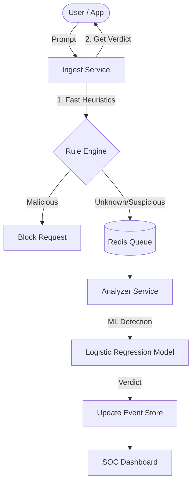

# TENET AI - Architecture Deep Dive

This document provides a technical walkthrough of how TENET AI protects Large Language Model applications.

---

## 🏗️ System Architecture Overview

TENET AI is designed as a **decoupled security layer**. It sits between the user/application and the LLM provider (like OpenAI, Claude, or local Llama).

---

## 🛡️ The Defense Lifecycle

### 1. Interception (The Ingest Service)
The **Ingest Service** is a high-performance FastAPI server. Its goal is to minimize latency.
- It receives the prompt and immediately runs **Phase 1 Defense**: Regex-based heuristic checks.
- If a known attack pattern (e.g., "Ignore previous instructions") is found, it blocks the request in **< 10ms**.

### 2. Async Analysis (The Analyzer Service)
For complex prompts that aren't obvious attacks, the engine uses **Phase 2 Defense**:
- The prompt is pushed to a **Redis-backed queue**.
- The **Analyzer Service** (ML Engine) picks it up.
- It converts the text into numbers using a **TF-IDF Vectorizer**.
- A **Logistic Regression Classifier** (trained on thousands of adversarial samples) calculates a risk score (0.0 to 1.0).

### 3. Visual Monitoring (The SOC Dashboard)
Every event is stored in a structured format. The **Dashboard** (React) polls the Ingest API to show:
- **Total Interceptions**: Scale of protection.
- **Threat Heatmap**: What kind of attacks are most frequent (Jailbreaks vs. Data Extraction).
- **Service Health**: Operational status of the security infrastructure.

---

## 📂 Key Technical Components

### Model Training (`scripts/train_model.py`)
This script uses **Scikit-Learn** to build the protection brain. It handles:
- **Automatic Dataset Synthesis**: Creates a baseline of malicious/benign prompts.
- **TF-IDF N-grams**: Looks at sequences of words (e.g., "forget your system") instead of just single words.
- **Model Persistence**: Saves the brain as `.joblib` files for the Analyzer to load.

### Plug-and-Play Integration (`examples/llm_plugin_demo.py`)
This is the "Proof of Concept" for developers. It wraps any existing LLM client with code that:
1. Calls TENET AI.
2. Waits for a blocking decision.
3. Only proceeds to the LLM if the prompt is safe.

---

> [!IMPORTANT]
> TENET AI is designed for **Defense-in-Depth**. No single layer (heuristics or ML) is 100% perfect, but combined they create a formidable barrier for LLM applications.
